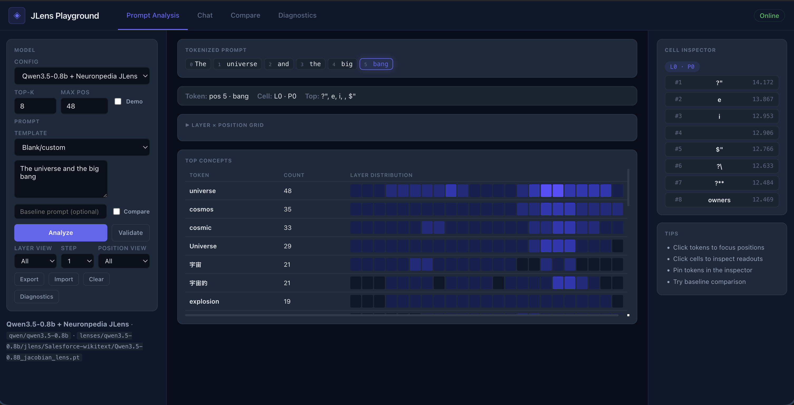

# Local JLens Playground

A local [Jacobian Lens](https://github.com/anthropics/jacobian-lens) explorer



## Quickstart

```bash
./run.sh              # creates env, installs deps, starts both servers
```

Open **http://127.0.0.1:5173**, select "Demo Synthetic Readout", click **Analyze**. `Ctrl+C` to stop.

Or manually:

```bash
# Terminal 1
conda env create -f environment.yml && conda activate local-jlens
cd backend && python -m app.main     # http://127.0.0.1:8787

# Terminal 2
cd frontend && npm install && npm run dev  # http://127.0.0.1:5173
```

## Real models

```bash
python scripts/list_hf_lenses.py                        # browse available lenses
python scripts/download_lens.py --model-folder gpt2-small
python scripts/setup_config.py                          # add model config
```

Select your model in the UI and click **Analyze**.

## Development

```bash
pytest                     # 26 tests, no real model needed
cd frontend && npm run build  # production build
```

## Diagnostics

Click **Diagnostics** in the UI to check backend status, torch, MPS/CUDA, jlens, and config paths.

## License

MIT. See `LICENSE`.
